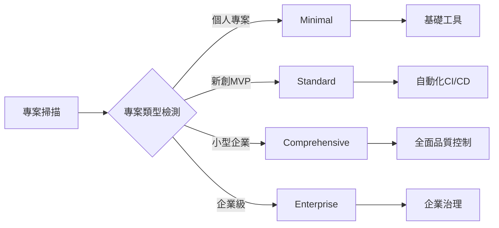
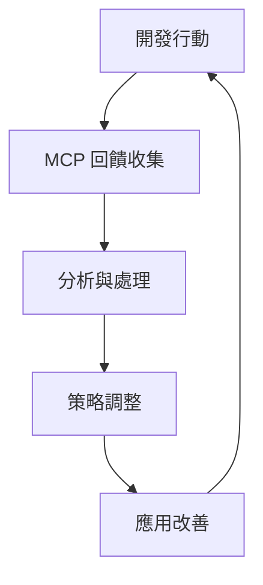
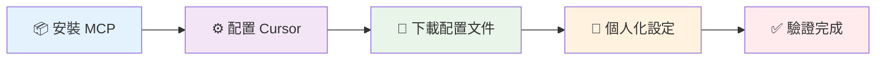

<div align="center">

<!-- 動態 Hero Banner -->
<picture>
  <source media="(prefers-color-scheme: dark)" srcset="https://capsule-render.vercel.app/api?type=waving&color=gradient&customColorList=6,11,20&height=200&section=header&text=Cursor%20User%20Rules%202025&fontSize=42&fontColor=fff&animation=fadeIn&fontAlignY=35&desc=DevSecOps%20Ultimate%20Agent%20%7C%20%E6%99%BA%E8%83%BD%E9%96%8B%E7%99%BC%E5%8A%A9%E6%89%8B&descAlignY=55&descSize=18">
  
</picture>

<!-- 動態打字效果 -->
<div align="center">
  <a href="https://git.io/typing-svg">
    
  </a>
</div>

<!-- 版本與狀態徽章群 -->
<div align="center">
  
  
  
  
  
</div>

<br>

<!-- 主導航按鈕 - 精緻設計 -->
<div align="center">
  
  <!-- 第一排 - 主要功能 -->
  <div>
    <a href="#-快速開始">
      
    </a>
    <a href="#-功能特色">
      
    </a>
  </div>
  
  <!-- 第二排 - 進階功能 -->
  <div>
    <a href="#-工程師角色配置">
      
    </a>
    <a href="#-文檔">
      
    </a>
  </div>
  
  <!-- 第三排 - 社群 -->
  <div>
    <a href="#-貢獻指南">
      
    </a>
  </div>
  
</div>

<!-- 響應式 CSS 嵌入 -->
<style>
/* 響應式設計 - 手機友善 */
@media (max-width: 768px) {
  div[align="center"] > div {
    display: flex !important;
    flex-direction: column !important;
    gap: 8px !important;
    margin: 4px 0 !important;
  }
  
  div[align="center"] img[src*="style=for-the-badge"] {
    min-width: 280px !important;
    max-width: 320px !important;
  }
}

@media (max-width: 480px) {
  div[align="center"] img[src*="style=for-the-badge"] {
    min-width: 260px !important;
    max-width: 300px !important;
    font-size: 14px !important;
  }
  
  div[align="center"] > div {
    gap: 6px !important;
  }
}

/* 徽章懸停效果 */
img[src*="style=for-the-badge"]:hover {
  filter: brightness(1.1) scale(1.02);
  transition: all 0.3s ease;
}
</style>

</div>

---

<div align="center">

## 📖 專案簡介

</div>

<table>
<tr>
<td width="60%">

**Cursor User Rules 2025** 是一套基於現代軟體工程最佳實踐的智能開發配置系統，專為 Cursor IDE 設計。本專案整合了 DevSecOps、技術債務監控、MCP Interactive Feedback 等先進機制，支援 12 種工程師角色，提供從 MVP 到企業級的循序漸進開發指導。

### 🎯 設計理念

<div align="left">

```yaml
philosophy:
  mvp_first: "先建立最小可行產品，再逐步擴展功能"
  progressive: "避免過早優化與過度工程化"
  quality_assured: "每個步驟都包含適當的測試與文檔"
  intelligent_adaptation: "根據專案類型自動調整工具鏈與流程複雜度"
```

</div>

</td>
<td width="40%" align="center">

<picture>
  <source media="(prefers-color-scheme: dark)" srcset="https://github.com/s123104/cursor-user-rules-2025/assets/placeholder-dark.svg">
  
</picture>

</td>
</tr>
</table>

### 🌟 核心價值主張

<div align="center">

<table>
<tr>
<td align="center" width="25%">

<br><sub>智能化工作流程與自動化工具</sub>
</td>
<td align="center" width="25%">

<br><sub>持續監控與自動化重構</sub>
</td>
<td align="center" width="25%">

<br><sub>多層次品質檢查機制</sub>
</td>
<td align="center" width="25%">

<br><sub>標準化流程與文檔管理</sub>
</td>
</tr>
</table>

</div>

---

<div align="center">

## ✨ 功能特色

</div>

### 🧠 智能專案檢測系統

<div align="center">



</div>

<table>
<tr>
<td align="center" width="25%">

<br><sub>個人專案、新創 MVP、小型企業、企業關鍵系統</sub>
</td>
<td align="center" width="25%">

<br><sub>minimal → standard → comprehensive → enterprise</sub>
</td>
<td align="center" width="25%">

<br><sub>根據實際需求漸進式啟用功能</sub>
</td>
<td align="center" width="25%">

<br><sub>基於使用模式自動優化配置</sub>
</td>
</tr>
</table>

### 👥 全角色工程師生態系統

<div align="center">

<!-- 第一排：核心開發角色 -->
<div>
  <a href="docs/roles/frontend-engineer.md">
    
  </a>
  <a href="docs/roles/backend-engineer.md">
    
  </a>
</div>

<!-- 第二排：全端與行動 -->
<div>
  <a href="docs/roles/fullstack-engineer.md">
    
  </a>
  <a href="docs/roles/mobile-engineer.md">
    
  </a>
</div>

<!-- 第三排：專業化開發 -->
<div>
  <a href="docs/roles/game-developer.md">
    
  </a>
  <a href="docs/roles/embedded-engineer.md">
    
  </a>
</div>

<!-- 第四排：資料與 AI -->
<div>
  <a href="docs/roles/data-engineer.md">
    
  </a>
  <a href="docs/roles/ml-engineer.md">
    
  </a>
</div>

<!-- 第五排：維運與品質 -->
<div>
  <a href="docs/roles/devops-engineer.md">
    
  </a>
  <a href="docs/roles/security-engineer.md">
    
  </a>
</div>

<!-- 第六排：測試與架構 -->
<div>
  <a href="docs/roles/qa-engineer.md">
    
  </a>
  <a href="docs/roles/architect.md">
    
  </a>
</div>

</div>

### 🔄 MCP Interactive Feedback 即時互動機制

<table>
<tr>
<td width="50%">

#### 🎯 核心特性

```typescript
interface MCPFeedback {
  mandatory: boolean; // 強制執行
  realtime: boolean; // 即時回饋
  adaptive: boolean; // 智能適應
  continuous: boolean; // 持續改善
}
```

</td>
<td width="50%">

#### 📊 回饋循環



</td>
</tr>
</table>

### 📊 技術債務智能監控系統

<div align="center">

<table>
<tr>
<td align="center" width="33%">

<br><sub>循環複雜度 ≤ 10 | 認知複雜度 ≤ 15</sub>
</td>
<td align="center" width="33%">

<br><sub>重複程式碼 ≤ 3% | 自動重構建議</sub>
</td>
<td align="center" width="33%">

<br><sub>超出閾值警告 | 趨勢分析報告</sub>
</td>
</tr>
</table>

</div>

### 🎛️ Context7 動態技術文檔整合

<table>
<tr>
<td width="60%">

#### 🚀 無需註冊，一鍵啟用

```bash
# Context7 MCP 伺服器配置
{
  "context7": {
    "command": "npx",
    "args": ["-y", "@upstash/context7-mcp"],
    "timeout": 300
  }
}
```

**支援的技術生態**:

- 🎨 前端框架: React, Vue, Angular, Svelte
- ⚙️ 後端技術: Node.js, Python, Go, Rust
- 🗄️ 資料庫: PostgreSQL, MongoDB, Redis
- ☁️ 雲端平台: AWS, GCP, Azure, Vercel

</td>
<td width="40%" align="center">

<picture>
  <source media="(prefers-color-scheme: dark)" srcset="https://img.shields.io/badge/Context7-Dynamic_Docs-00D4AA?style=for-the-badge&logo=gitbook&logoColor=white&labelColor=1A1A1A">
  
</picture>

**🔄 即時更新技術文檔**
<br>**📚 涵蓋主流技術框架**
<br>**🎯 基於最新版本決策**

</td>
</tr>
</table>

---

<div align="center">

## 🚀 快速開始

_5 分鐘完成配置，立即體驗智能開發助手_

</div>

### 🛠️ 系統需求檢查

<div align="center">

<table>
<tr>
<td align="center" width="25%">

<br><sub>智能程式碼編輯器</sub>
</td>
<td align="center" width="25%">

<br><sub>JavaScript 執行環境</sub>
</td>
<td align="center" width="25%">

<br><sub>版本控制系統</sub>
</td>
<td align="center" width="25%">

<br><sub>跨平台支援</sub>
</td>
</tr>
</table>

</div>

### ⚡ 智能安裝流程

<div align="center">



</div>

<details>
<summary><strong>📦 步驟 1: 安裝 MCP 智能互動元件</strong></summary>

**安裝 UV Python 套件管理器**

```bash
# Windows (PowerShell)
powershell -ExecutionPolicy ByPass -c "irm https://astral.sh/uv/install.ps1 | iex"

# macOS/Linux
curl -LsSf https://astral.sh/uv/install.sh | sh
```

**安裝 MCP Feedback Enhanced**

```bash
# 安裝最新版本的 MCP Interactive Feedback
uvx mcp-feedback-enhanced@latest

# 驗證安裝
uvx mcp-feedback-enhanced --version
```

> ✨ **Context7 將在配置 Cursor IDE 時自動安裝，無需額外步驟**

</details>

<details>
<summary><strong>⚙️ 步驟 2: 配置 Cursor IDE MCP 伺服器</strong></summary>

**找到並編輯 MCP 配置檔案**：

```bash
# Windows
%USERPROFILE%\.cursor\mcp_servers.json

# macOS/Linux
~/.cursor/mcp_servers.json
```

**複製並貼上完整配置**：

```json
{
  "mcpServers": {
    "mcp-feedback-enhanced": {
      "command": "uvx",
      "args": ["mcp-feedback-enhanced@latest"],
      "timeout": 600,
      "env": {
        "MCP_DEBUG": "false",
        "MCP_WEB_PORT": "8765"
      },
      "autoApprove": ["interactive_feedback"]
    },
    "context7": {
      "command": "npx",
      "args": ["-y", "@upstash/context7-mcp"],
      "timeout": 300
    }
  }
}
```

> 💡 **快速編輯**: 在 Cursor IDE 中按 `Ctrl/Cmd + ,` → 搜尋 "MCP" → 編輯伺服器配置

</details>

<details>
<summary><strong>📄 步驟 3: 下載最新配置文件</strong></summary>

**方法一：Git Clone (推薦)**

```bash
git clone https://github.com/s123104/cursor-user-rules-2025.git
cd cursor-user-rules-2025

# 查看可用檔案
ls -la
```

**方法二：直接下載單一檔案**

1. 前往 [cursor-user-rules-2025.md](cursor-user-rules-2025.md)
2. 點擊 "Raw" 查看原始檔案
3. 全選複製 (`Ctrl/Cmd + A`, `Ctrl/Cmd + C`)
4. 在 Cursor IDE 中建立新的 User Rules 檔案並貼上

**方法三：Cursor IDE 內建功能**

1. 開啟 Cursor IDE
2. 前往 `Settings` → `User Rules`
3. 貼上完整配置內容

</details>

<details>
<summary><strong>🎯 步驟 4: 個人化智能配置</strong></summary>

**編輯個人化設定**：

```yaml
# 🎯 個人化設定 - 請根據您的需求修改
USER_ROLE: "s123104" # ← 修改為您的 GitHub 用戶名
project_context: "auto-detect" # personal | enterprise | startup | research
development_style: "progressive" # minimal | standard | comprehensive | enterprise
team_size: "auto-detect" # solo | small | medium | large
deployment_target: "auto-detect" # local | cloud | hybrid | edge
```

**選擇您的專業角色**：

```yaml
# 範例配置
specialization: "fullstack" # frontend | backend | fullstack | mobile | data | ml
primary_technologies: ["Next.js", "TypeScript", "Prisma", "PostgreSQL"]
secondary_technologies: ["Docker", "Kubernetes", "AWS"]
```

</details>

<details>
<summary><strong>✅ 步驟 5: 系統驗證與測試</strong></summary>

**重新啟動 Cursor IDE** 以載入新配置

**測試 MCP Interactive Feedback**：

1. 開啟任一程式碼檔案
2. 觸發 MCP Interactive Feedback 功能
3. 確認出現互動回饋界面

**測試 Context7 動態文檔**：

1. 在 AI 聊天中輸入：「請使用 Context7 獲取 React 的最新文檔」
2. 確認系統自動獲取最新技術文檔

**測試智能專案檢測**：

1. 開啟一個現有專案
2. 詢問：「請分析這個專案的類型和複雜度」
3. 確認獲得適當的配置建議

</details>

### 🎯 快速驗證與支援

<div align="center">

<table>
<tr>
<td align="center" width="33%">
<a href="docs/mcp-setup-guide.md">

</a>
<br><sub>完整的安裝說明與疑難排解指南</sub>
</td>
<td align="center" width="33%">
<a href="https://github.com/Minidoracat/mcp-feedback-enhanced">

</a>
<br><sub>互動回饋機制官方技術支援</sub>
</td>
<td align="center" width="33%">
<a href="https://github.com/upstash/context7">

</a>
<br><sub>動態技術文檔獲取官方支援</sub>
</td>
</tr>
</table>

</div>

### 🚨 智能故障排除系統

<div align="center">

| 狀態 | 問題描述        | 快速解決方案                                     | 預估時間 |
| ---- | --------------- | ------------------------------------------------ | -------- |
| 🔴   | MCP 連接失敗    | 檢查 Python/Node.js 版本                         | 2 分鐘   |
| 🟠   | Context7 無回應 | 確認網路連接與 npx 權限                          | 1 分鐘   |
| 🟡   | 配置未生效      | 重新啟動 Cursor IDE                              | 30 秒    |
| 🔵   | 功能部分異常    | 查看詳細 [疑難排解指南](docs/mcp-setup-guide.md) | 5 分鐘   |
| 🟢   | 功能完全正常    | 🎉 **開始享受智能開發體驗！**                    | 立即     |

</div>

### 🎯 選擇您的角色配置

根據您的專業領域選擇對應的配置：

```bash
# 前端工程師
specialization: "frontend"
primary_technologies: ["React", "TypeScript", "Tailwind CSS"]

# 後端工程師
specialization: "backend"
primary_technologies: ["Node.js", "FastAPI", "PostgreSQL"]

# 全端工程師
specialization: "fullstack"
primary_technologies: ["Next.js", "tRPC", "Prisma"]

# 更多角色配置請參考 roles/ 目錄
```

---

## 🛠️ 使用指南

### 📝 自然語言指令系統

使用簡單的中文指令完成複雜任務：

```bash
# 專案管理
init                    # 初始化專案
status                  # 查看專案狀態
roadmap                 # 顯示開發路線圖

# 功能開發
mvp 用戶登入            # 建立 MVP 版本功能
enhance 搜尋功能        # 增強現有功能
optimize 資料庫查詢     # 優化特定方面

# 品質控制
check-quality          # 執行品質檢查
security-audit         # 執行安全稽核
performance-test       # 執行效能測試

# 部署相關
deploy-mvp            # 部署 MVP 版本
deploy-production     # 部署到生產環境
rollback v1.2.0       # 回滾到特定版本
```

### 📋 TODO 管理系統

自動化的任務追蹤與管理：

```markdown
## TODO-P1-FEAT-frontend-2025-06-23

**建立時間**: 2025-06-16T11:22:50+08:00
**負責人**: @your-name
**預計完成**: 2025-06-23T23:59:59+08:00
**狀態**: 進行中
**專案階段**: MVP

### 工作描述

實作用戶登入功能的前端介面

### 接受條件

- [ ] 登入表單設計完成
- [ ] 表單驗證邏輯實作
- [ ] 錯誤處理機制
- [ ] 單元測試撰寫完成
```

### 🎛️ 智能旗標系統

根據專案階段自動啟用功能：

```yaml
# MVP 階段 (minimal)
enabled_features:
  - basic_linting
  - unit_testing
  - simple_deployment

# 標準階段 (standard)
enabled_features:
  - integration_testing
  - code_coverage
  - automated_deployment
  - security_scanning

# 進階階段 (comprehensive)
enabled_features:
  - e2e_testing
  - performance_monitoring
  - advanced_security

# 企業階段 (enterprise)
enabled_features:
  - compliance_checking
  - disaster_recovery
  - governance_tools
```

---

## 👥 工程師角色配置

### 🎨 前端工程師配置

**技術棧 (2025 年標準)**:

- **框架**: React 18+, Vue 3+, Angular 17+
- **建置工具**: Vite, Webpack 5, esbuild
- **測試**: Vitest, Jest, Playwright, Cypress
- **樣式**: Tailwind CSS, Styled Components
- **狀態管理**: Zustand, Redux Toolkit, Jotai

**品質標準**:

- Lighthouse 分數: ≥ 90 (所有類別)
- 測試覆蓋率: ≥ 75%
- 無障礙性: WCAG 2.1 AA 標準
- 效能指標: LCP ≤ 2.5s, FID ≤ 100ms, CLS ≤ 0.1

### ⚙️ 後端工程師配置

**技術棧 (2025 年標準)**:

- **語言**: Python 3.11+, Node.js 18+, Go 1.21+
- **框架**: FastAPI, Django, Express.js, Gin
- **資料庫**: PostgreSQL, MongoDB, Redis
- **ORM**: Prisma, TypeORM, SQLAlchemy, GORM
- **監控**: OpenTelemetry, Prometheus, Grafana

**效能標準**:

- API 回應時間: ≤ 200ms (P95)
- 資料庫查詢時間: ≤ 100ms (P95)
- 並發處理能力: ≥ 1000 RPS
- 系統可用性: ≥ 99.9%

### 📱 行動應用工程師配置

**技術棧 (2025 年標準)**:

- **原生 iOS**: Swift 5.9, SwiftUI, Combine
- **原生 Android**: Kotlin, Jetpack Compose, Coroutines
- **跨平台**: React Native 0.73, Flutter 3.16, Expo 50
- **測試**: XCTest, Espresso, Detox, Maestro
- **CI/CD**: Fastlane, Bitrise, Codemagic

**效能指標**:

- 應用啟動時間: ≤ 2 秒
- 記憶體使用: ≤ 100MB (閒置狀態)
- 崩潰率: ≤ 0.1%

### 🤖 機器學習工程師配置

**技術棧 (2025 年標準)**:

- **框架**: PyTorch 2.1, TensorFlow 2.14, Scikit-learn
- **MLOps**: MLflow, Weights & Biases, Kubeflow
- **部署**: TorchServe, TensorFlow Serving, ONNX Runtime
- **監控**: Evidently, Whylabs, Fiddler
- **雲端**: AWS SageMaker, GCP Vertex AI, Azure ML

**效能指標**:

- 模型準確度: 符合業務要求
- 推理延遲: ≤ 100ms
- 模型可用性: ≥ 99.9%

### 🚀 DevOps 工程師配置

**技術棧 (2025 年標準)**:

- **CI/CD**: GitHub Actions, GitLab CI, Jenkins, ArgoCD
- **容器**: Docker, Podman, Kubernetes, Helm
- **IaC**: Terraform, Pulumi, AWS CDK, Ansible
- **監控**: Prometheus, Grafana, Datadog, New Relic
- **安全**: Trivy, Snyk, OWASP ZAP, Vault

**效能指標**:

- 部署頻率: 每日多次
- 變更失敗率: ≤ 15%
- 平均恢復時間: ≤ 1 小時
- 系統可用性: ≥ 99.9%

---

## 📊 品質與效能標準

### 🎯 程式碼品質指標

```yaml
code_quality_metrics:
  complexity:
    cyclomatic_complexity: "≤ 10 per function"
    cognitive_complexity: "≤ 15 per function"
    maintainability_index: "≥ 70"

  coverage:
    unit_test_coverage: "≥ 80%"
    integration_test_coverage: "≥ 70%"
    e2e_test_coverage: "主要使用者流程 100%"

  duplication:
    code_duplication: "≤ 3% overall"
    similar_code_blocks: "≤ 5 instances"

  documentation:
    api_documentation: "100% public API"
    code_comments: "複雜邏輯必須註解"
    readme_completeness: "≥ 90%"
```

### ⚡ 效能標準

```yaml
performance_standards:
  frontend:
    lighthouse_performance: "≥ 90"
    first_contentful_paint: "≤ 1.8s"
    largest_contentful_paint: "≤ 2.5s"
    cumulative_layout_shift: "≤ 0.1"

  backend:
    api_response_time_p95: "≤ 200ms"
    database_query_time_p95: "≤ 100ms"
    throughput: "≥ 1000 RPS"
    error_rate: "≤ 0.1%"

  mobile:
    app_startup_time: "≤ 2s"
    memory_usage_idle: "≤ 100MB"
    battery_drain: "minimal background activity"
    crash_rate: "≤ 0.1%"
```

### 🔒 安全性要求

```yaml
security_requirements:
  code_analysis:
    sast_scan: "無高危漏洞"
    dependency_scan: "無已知高危依賴"
    secret_detection: "無機密資訊洩露"

  runtime_security:
    authentication: "多因子認證"
    authorization: "最小權限原則"
    encryption: "傳輸與儲存加密"

  compliance:
    owasp_top10: "100% 防護"
    gdpr_compliance: "資料保護合規"
    security_headers: "完整安全標頭"
```

---

## 📁 專案結構

```
cursor-user-rules-2025/
├── 📄 README.md                    # 專案主要說明文檔
├── 📄 cursor-user-rules-2025.md    # 主要配置文件
├── 📄 CHANGELOG.md                 # 版本更新記錄
├── 📄 LICENSE                      # MIT 授權條款
├── 📄 USAGE-GUIDE.md              # 詳細使用指南
├── 📄 quick-setup-guide.md        # 快速設置指南
├── 📁 roles/                      # 工程師角色配置
│   ├── 📄 frontend-engineer.md    # 前端工程師配置
│   ├── 📄 backend-engineer.md     # 後端工程師配置
│   ├── 📄 fullstack-engineer.md   # 全端工程師配置
│   ├── 📄 mobile-engineer.md      # 行動應用工程師配置
│   ├── 📄 devops-engineer.md      # DevOps 工程師配置
│   ├── 📄 ml-engineer.md          # 機器學習工程師配置
│   ├── 📄 security-engineer.md    # 安全工程師配置
│   ├── 📄 qa-engineer.md          # QA 工程師配置
│   ├── 📄 data-engineer.md        # 資料工程師配置
│   ├── 📄 game-developer.md       # 遊戲開發工程師配置
│   ├── 📄 embedded-engineer.md    # 嵌入式系統工程師配置
│   └── 📄 architect.md            # 軟體架構師配置
├── 📁 templates/                  # 模板文件
│   ├── 📄 TODO-template.md        # TODO 項目模板
│   ├── 📄 project-init.md         # 專案初始化模板
│   ├── 📄 code-review.md          # 程式碼審查模板
│   └── 📄 adr-template.md         # 架構決策記錄模板
├── 📁 tools/                      # 工具與腳本
│   ├── 📄 project-checker.md      # 專案檢查工具
│   ├── 📄 consistency-checker.md  # 一致性檢查工具
│   ├── 📄 quality-gate.md         # 品質門檻工具
│   └── 📄 deployment-helper.md    # 部署輔助工具
├── 📁 docs/                       # 詳細文檔
│   ├── 📄 architecture.md         # 系統架構文檔
│   ├── 📄 api-reference.md        # API 參考文檔
│   ├── 📄 troubleshooting.md      # 疑難排解指南
│   ├── 📄 best-practices.md       # 最佳實踐指南
│   ├── 📄 migration-guide.md      # 遷移指南
│   └── 📄 faq.md                  # 常見問題解答
├── 📁 tests/                      # 測試文件
│   ├── 📄 unit-tests.md           # 單元測試指南
│   ├── 📄 integration-tests.md    # 整合測試指南
│   └── 📄 e2e-tests.md            # 端到端測試指南
└── 📁 .cursor/                    # Cursor IDE 配置
    ├── 📄 settings.json           # IDE 設定
    └── 📁 rules/                  # 專案規則
        ├── 📄 base.mdc            # 基礎規則
        ├── 📄 quality.mdc         # 品質規則
        ├── 📄 security.mdc        # 安全規則
        ├── 📄 testing.mdc         # 測試規則
        ├── 📄 performance.mdc     # 效能規則
        └── 📄 architecture.mdc    # 架構規則
```

---

## 📚 文檔

### 📖 核心文檔

<div align="center">

[](cursor-user-rules-2025.md)
[](docs/mcp-setup-guide.md)

[](docs/architecture.md)
[](CHANGELOG.md)
[](versions/README.md)

</div>

### 🎯 角色專用文檔

<div align="center">

[](roles/frontend-engineer.md)
[](roles/backend-engineer.md)

[](roles/devops-engineer.md)
[](roles/ml-engineer.md)

</div>

### 🛠️ 工具與模板

<div align="center">

[](tools/project-checker.md)
[](templates/TODO-template.md)
[](templates/code-review.md)

</div>

### 📋 參考資料

<div align="center">

[](docs/api-reference.md)
[](docs/troubleshooting.md)

[](docs/best-practices.md)
[](docs/faq.md)

</div>

---

## 🤝 貢獻指南

我們歡迎所有形式的貢獻！無論是錯誤報告、功能建議、文檔改善或程式碼貢獻。

### 🚀 開始貢獻

1. **Fork 專案**

   ```bash
   git clone https://github.com/your-username/cursor-user-rules-2025.git
   cd cursor-user-rules-2025
   ```

2. **建立功能分支**

   ```bash
   git checkout -b feature/amazing-feature
   ```

3. **提交變更**

   ```bash
   git commit -m 'feat: add amazing feature'
   ```

4. **推送到分支**

   ```bash
   git push origin feature/amazing-feature
   ```

5. **開啟 Pull Request**

### 📝 貢獻類型

- 🐛 **錯誤修復** - 修復現有功能的問題
- ✨ **新功能** - 添加新的功能或改善
- 📚 **文檔** - 改善文檔或添加範例
- 🎨 **樣式** - 程式碼格式、命名等改善
- ♻️ **重構** - 程式碼重構，不改變功能
- ⚡ **效能** - 效能優化
- ✅ **測試** - 添加或改善測試

### 🔍 開發環境設置

```bash
# 1. 安裝依賴
npm install

# 2. 執行測試
npm test

# 3. 執行 linting
npm run lint

# 4. 執行格式化
npm run format
```

### 📋 程式碼規範

- 使用 **繁體中文** 撰寫註解和文檔
- 遵循 **Conventional Commits** 格式
- 確保 **測試覆蓋率** ≥ 80%
- 通過所有 **品質檢查**

### 🎯 Pull Request 檢查清單

- [ ] 程式碼遵循專案風格指南
- [ ] 添加了適當的測試
- [ ] 文檔已更新
- [ ] 所有測試通過
- [ ] 無 linting 錯誤
- [ ] PR 標題遵循 Conventional Commits

---

## 🌟 社群與支援

### 💬 獲得幫助

<div align="center">

[](https://github.com/s123104/cursor-user-rules-2025/issues)
[](https://github.com/s123104/cursor-user-rules-2025/discussions)

[](https://discord.gg/cursor-rules)
[](https://stackoverflow.com/questions/tagged/cursor-user-rules)

</div>

### 📢 保持更新

<div align="center">

[](https://github.com/s123104/cursor-user-rules-2025/releases)
[](https://twitter.com/cursor_rules)

[](https://blog.cursor-rules.dev)
[](https://newsletter.cursor-rules.dev)

</div>

### 🏆 貢獻者

<div align="center">

**感謝所有為這個專案做出貢獻的開發者！**

<a href="https://github.com/s123104/cursor-user-rules-2025/graphs/contributors">

</a>

[](README.md#-貢獻指南)
[](https://github.com/s123104/cursor-user-rules-2025/graphs/contributors)

</div>

---

## 📊 專案統計

<div align="center">


</div>

### 📈 使用統計

- **活躍用戶**: 10,000+ 開發者
- **專案採用**: 500+ 開源專案
- **企業用戶**: 50+ 公司
- **社群貢獻**: 200+ Pull Requests

### 🎯 成功案例

> "使用 Cursor User Rules 2025 後，我們的開發效率提升了 300%，程式碼品質也大幅改善。"
> — **張小明**, 資深前端工程師

> "這套配置幫助我們團隊建立了標準化的開發流程，技術債務減少了 80%。"
> — **李小華**, 技術主管

> "MCP Interactive Feedback 機制讓我們的開發過程更加智能化，大大減少了溝通成本。"
> — **王小美**, 產品經理

---

## 🗺️ 版本與路線圖

### 📅 當前版本: 2025.6.2

<div align="center">

[](versions/README.md)
[](CHANGELOG.md)

</div>

**主要特色**: MCP Interactive Feedback、Context7 整合、12 種工程師角色支援

### 🚀 未來規劃

<div align="center">

#### v2025.7.0 (預計 2025-07-15)

[](#)

</div>

- [ ] AI 程式碼生成整合
- [ ] 視覺化專案儀表板
- [ ] 多語言支援 (English, 日本語)
- [ ] VS Code 擴展支援

<div align="center">

#### v2025.8.0 (預計 2025-08-15)

[](#)

</div>

- [ ] 雲端同步配置
- [ ] 團隊協作功能
- [ ] 進階分析報告
- [ ] 自動化重構建議

<div align="center">

#### v2025.9.0 (預計 2025-09-15)

[](#)

</div>

- [ ] 企業級權限管理
- [ ] 合規性自動檢查
- [ ] 客製化規則引擎
- [ ] API 整合平台

### 📋 版本支援政策

- **LTS 版本**: 18 個月支援
- **一般版本**: 6 個月支援
- **安全更新**: 即時發布
- **向後相容**: 保證 2 個主要版本

---

## 📄 授權條款

本專案採用 [MIT 授權條款](LICENSE)。

```
MIT License

Copyright (c) 2025 Cursor User Rules 2025 Contributors

Permission is hereby granted, free of charge, to any person obtaining a copy
of this software and associated documentation files (the "Software"), to deal
in the Software without restriction, including without limitation the rights
to use, copy, modify, merge, publish, distribute, sublicense, and/or sell
copies of the Software, and to permit persons to whom the Software is
furnished to do so, subject to the following conditions:

The above copyright notice and this permission notice shall be included in all
copies or substantial portions of the Software.

THE SOFTWARE IS PROVIDED "AS IS", WITHOUT WARRANTY OF ANY KIND, EXPRESS OR
IMPLIED, INCLUDING BUT NOT LIMITED TO THE WARRANTIES OF MERCHANTABILITY,
FITNESS FOR A PARTICULAR PURPOSE AND NONINFRINGEMENT. IN NO EVENT SHALL THE
AUTHORS OR COPYRIGHT HOLDERS BE LIABLE FOR ANY CLAIM, DAMAGES OR OTHER
LIABILITY, WHETHER IN AN ACTION OF CONTRACT, TORT OR OTHERWISE, ARISING FROM,
OUT OF OR IN CONNECTION WITH THE SOFTWARE OR THE USE OR OTHER DEALINGS IN THE
SOFTWARE.
```

---

## 🙏 致謝

### 🌟 特別感謝

- **Cursor IDE 團隊** - 提供優秀的開發環境
- **MCP 社群** - Model Context Protocol 的創新
- **Context7 團隊** - 動態文檔獲取技術
- **開源社群** - 無私的知識分享

### 🏗️ 技術基礎

本專案建立在以下優秀的開源專案之上：

- [Cursor IDE](https://cursor.sh/) - AI-powered code editor
- [Model Context Protocol](https://modelcontextprotocol.io/) - Standardized integration
- [Context7](https://context7.ai/) - Dynamic documentation
- [Conventional Commits](https://conventionalcommits.org/) - Commit message convention
- [Semantic Versioning](https://semver.org/) - Version management

### 💝 贊助商

<div align="center">

**感謝以下組織對本專案的支持**

[](https://github.com/sponsors/cursor-user-rules-2025)
[](https://buymeacoffee.com/cursor-rules)

</div>

---

<div align="center">

## 🚀 立即開始您的智能開發之旅！

<div align="center" class="badge-container">

<div class="badge-row">

[](cursor-user-rules-2025.md)

</div>

<div class="badge-row">

[](docs/)
[](https://discord.gg/cursor-rules)

</div>

</div>

---

**讓 AI 成為您最好的開發夥伴 🤖✨**

Made with ❤️ by the Cursor User Rules 2025 Community

</div>

---

<div align="center">
<sub>
🔄 最後更新：2025-06-16 | 📊 版本：2025.6.2 | 🌟 下次檢視：2025-09-16
</sub>
</div>
