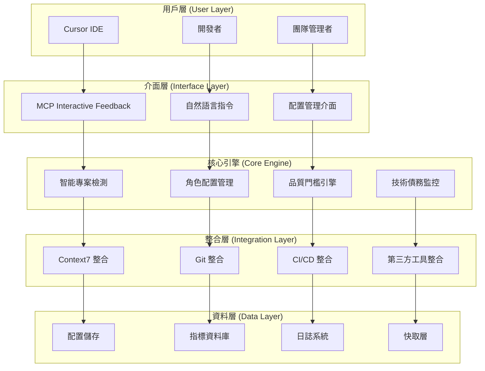
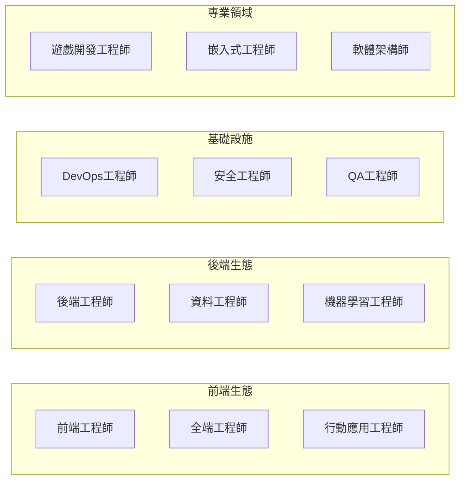
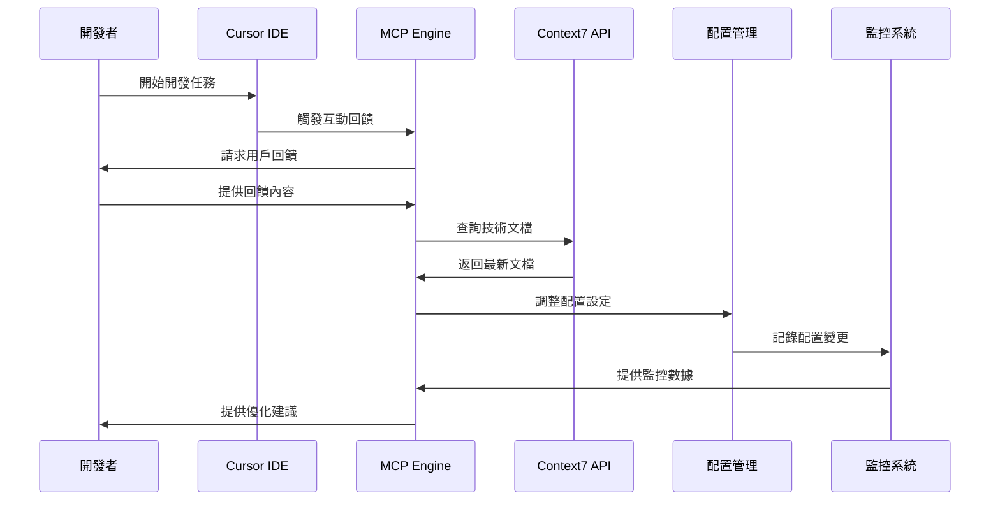
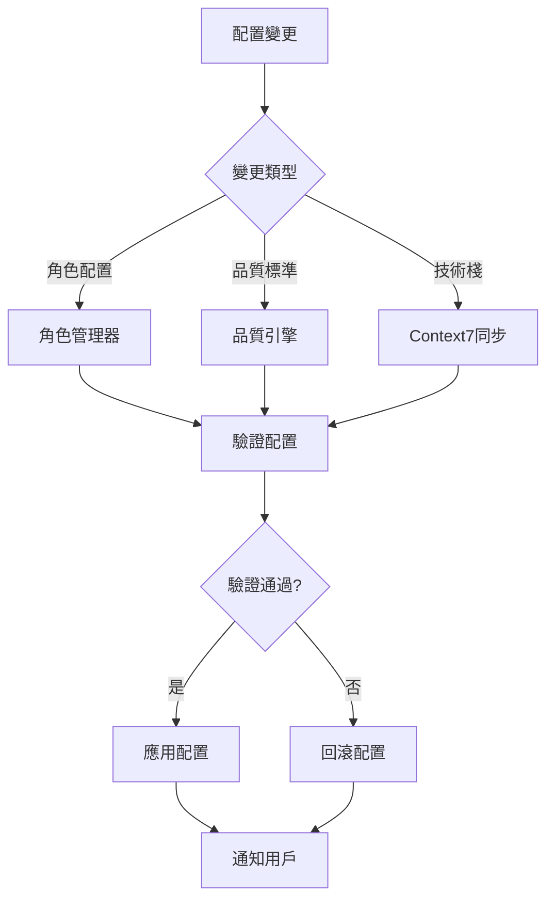
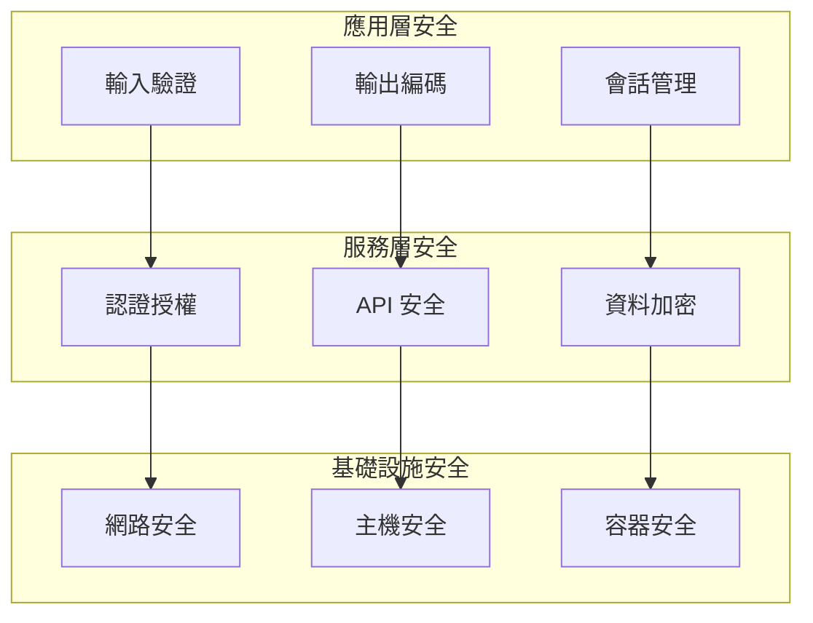
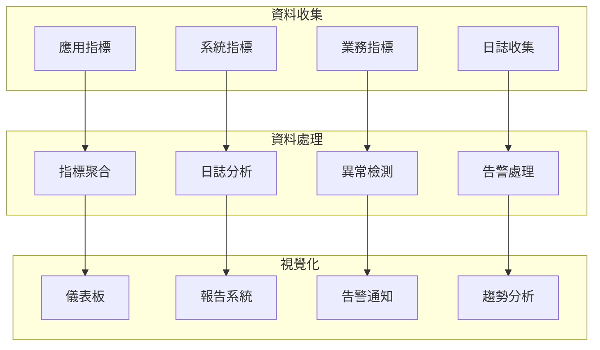

# 系統架構文檔

**版本**: 2025.6.2  
**最後更新**: 2025-06-16T11:22:50+08:00  
**維護者**: Cursor User Rules 2025 Team

---

## 📋 目錄

- [整體架構](#-整體架構)
- [核心組件](#-核心組件)
- [資料流架構](#-資料流架構)
- [擴展性設計](#-擴展性設計)
- [效能考量](#-效能考量)
- [安全性架構](#-安全性架構)
- [部署架構](#-部署架構)
- [監控與觀測](#-監控與觀測)
- [技術決策記錄](#-技術決策記錄)

---

## 🏗️ 整體架構

Cursor User Rules 2025 採用模組化、可擴展的架構設計，支援從個人開發到企業級應用的各種場景。



---

## 🔧 核心組件

### 1. MCP Interactive Feedback 引擎

**職責**: 管理用戶互動回饋循環，確保每個開發步驟都包含用戶回饋。

**技術實作**:

```yaml
component: MCP_Interactive_Feedback_Engine
architecture: Event-Driven
patterns:
  - Observer Pattern
  - Command Pattern
  - State Machine
interfaces:
  - REST API
  - WebSocket (即時回饋)
  - CLI Interface
```

**核心功能**:

- 強制回饋循環管理
- 智能回饋分析
- 自動調整建議
- 回饋歷史追蹤

### 2. Context7 整合模組

**職責**: 動態獲取最新技術文檔，確保技術決策基於最新資訊。

**技術實作**:

```yaml
component: Context7_Integration_Module
architecture: Microservice
patterns:
  - Adapter Pattern
  - Cache-Aside Pattern
  - Circuit Breaker
data_flow:
  - 技術查詢 → Context7 API
  - 文檔快取 → Redis
  - 版本同步 → 定時任務
```

**核心功能**:

- 動態文檔獲取
- 版本同步管理
- 快取策略優化
- 離線模式支援

### 3. 智能專案檢測系統

**職責**: 自動識別專案類型並調整配置複雜度。

**檢測矩陣**:

```yaml
detection_matrix:
  personal_project:
    indicators:
      - single_contributor: true
      - simple_structure: true
      - no_ci_cd: true
    complexity: minimal

  startup_mvp:
    indicators:
      - team_size: 2-5
      - rapid_iteration: true
      - basic_testing: true
    complexity: standard

  enterprise_system:
    indicators:
      - team_size: 20+
      - compliance_required: true
      - high_availability: true
    complexity: enterprise
```

### 4. 角色配置管理器

**職責**: 管理 12 種工程師角色的專業配置。

**角色架構**:



### 5. 技術債務監控引擎

**職責**: 持續監控並減少技術債務。

**監控指標**:

```yaml
technical_debt_metrics:
  code_quality:
    cyclomatic_complexity: "≤ 10"
    cognitive_complexity: "≤ 15"
    code_duplication: "≤ 3%"
    maintainability_index: "≥ 70"

  architecture_debt:
    coupling_metrics: "low_coupling_high_cohesion"
    dependency_violations: 0
    layer_violations: 0

  test_debt:
    test_coverage: "≥ 80%"
    test_quality: "mutation_score ≥ 70%"
    test_maintenance: "ratio ≤ 1:2"
```

---

## 🔄 資料流架構

### 主要資料流



### 配置同步流程



---

## 🚀 擴展性設計

### 插件架構

系統採用插件架構，支援第三方擴展：

```yaml
plugin_architecture:
  core_interfaces:
    - IRoleProvider
    - IQualityChecker
    - IDeploymentStrategy
    - IMonitoringProvider

  plugin_types:
    - role_extensions
    - quality_analyzers
    - deployment_adapters
    - monitoring_integrations

  plugin_lifecycle:
    - discovery
    - validation
    - loading
    - execution
    - unloading
```

### 角色配置擴展

新增工程師角色的標準流程：

```yaml
role_extension_process:
  1_definition:
    - role_name: "新角色名稱"
    - technical_stack: "技術棧定義"
    - quality_standards: "品質標準"
    - best_practices: "最佳實踐"

  2_implementation:
    - config_file: "roles/new-role.md"
    - validation_rules: "驗證規則"
    - integration_tests: "整合測試"

  3_registration:
    - plugin_manifest: "插件清單"
    - dependency_check: "依賴檢查"
    - compatibility_test: "相容性測試"
```

---

## ⚡ 效能考量

### 快取策略

```yaml
caching_strategy:
  levels:
    L1_memory_cache:
      - 配置資料
      - 常用模板
      - 用戶偏好
      ttl: 300s

    L2_redis_cache:
      - Context7 文檔
      - 監控數據
      - 分析結果
      ttl: 3600s

    L3_persistent_cache:
      - 歷史數據
      - 統計報告
      - 備份配置
      ttl: 86400s
```

### 效能指標

```yaml
performance_targets:
  response_time:
    configuration_load: "< 100ms"
    feedback_processing: "< 200ms"
    context7_query: "< 500ms"

  throughput:
    concurrent_users: "> 1000"
    configuration_updates: "> 100/s"
    monitoring_events: "> 10000/s"

  resource_usage:
    memory_usage: "< 512MB"
    cpu_usage: "< 50%"
    disk_io: "< 100MB/s"
```

---

## 🔒 安全性架構

### 安全層級



### 威脅模型

```yaml
threat_model:
  data_threats:
    - 配置資料洩露
    - 敏感資訊暴露
    - 資料完整性破壞

  access_threats:
    - 未授權存取
    - 權限提升
    - 會話劫持

  infrastructure_threats:
    - DDoS 攻擊
    - 惡意程式碼注入
    - 供應鏈攻擊

  mitigation_strategies:
    - 多層防護
    - 最小權限原則
    - 零信任架構
```

---

## 🌐 部署架構

### 部署模式

```yaml
deployment_modes:
  standalone:
    description: "單機部署模式"
    use_case: "個人開發者"
    components:
      - cursor_rules_engine
      - local_cache
      - file_storage

  distributed:
    description: "分散式部署模式"
    use_case: "團隊協作"
    components:
      - load_balancer
      - multiple_instances
      - shared_cache
      - database_cluster

  cloud_native:
    description: "雲原生部署模式"
    use_case: "企業級應用"
    components:
      - kubernetes_cluster
      - service_mesh
      - auto_scaling
      - monitoring_stack
```

### 容器化架構

```dockerfile
# 多階段建置範例
FROM node:18-alpine AS builder
WORKDIR /app
COPY package*.json ./
RUN npm ci --only=production

FROM node:18-alpine AS runtime
WORKDIR /app
COPY --from=builder /app/node_modules ./node_modules
COPY . .
EXPOSE 3000
CMD ["npm", "start"]
```

---

## 📊 監控與觀測

### 監控架構



### 關鍵指標

```yaml
key_metrics:
  business_metrics:
    - active_users
    - configuration_adoption_rate
    - quality_improvement_score
    - technical_debt_reduction

  technical_metrics:
    - system_availability
    - response_time_p95
    - error_rate
    - throughput

  operational_metrics:
    - deployment_frequency
    - lead_time
    - mttr
    - change_failure_rate
```

---

## 📝 技術決策記錄

### ADR-001: 採用 MCP Interactive Feedback 機制

**狀態**: 已接受  
**日期**: 2025-06-16  
**決策者**: 架構團隊

**背景**:
需要確保開發過程中的持續回饋與改善。

**決策**:
採用 MCP Interactive Feedback 作為核心互動機制。

**後果**:

- 正面: 提升用戶參與度，確保配置符合實際需求
- 負面: 增加系統複雜度，需要額外的狀態管理

### ADR-002: 整合 Context7 動態文檔獲取

**狀態**: 已接受  
**日期**: 2025-06-16  
**決策者**: 技術團隊

**背景**:
技術框架更新頻繁，需要確保配置基於最新文檔。

**決策**:
整合 Context7 API 進行動態文檔獲取。

**後果**:

- 正面: 確保技術資訊的時效性和準確性
- 負面: 依賴外部服務，需要處理網路異常情況

### ADR-003: 採用模組化角色配置架構

**狀態**: 已接受  
**日期**: 2025-06-16  
**決策者**: 產品團隊

**背景**:
需要支援多種工程師角色，且要求易於擴展。

**決策**:
採用插件化的角色配置架構。

**後果**:

- 正面: 高度可擴展，支援客製化角色
- 負面: 初期開發複雜度較高

---

## 🔄 架構演進

### 版本演進路線圖

```yaml
architecture_evolution:
  v2025.6.x:
    focus: "核心功能建立"
    features:
      - MCP Interactive Feedback
      - Context7 整合
      - 基礎角色支援

  v2025.7.x:
    focus: "智能化增強"
    features:
      - AI 程式碼生成
      - 智能配置建議
      - 自動化重構

  v2025.8.x:
    focus: "協作與整合"
    features:
      - 團隊協作功能
      - 第三方工具整合
      - 雲端同步

  v2025.9.x:
    focus: "企業級特性"
    features:
      - 權限管理
      - 合規性檢查
      - 進階分析
```

---

## 📚 參考資料

### 架構模式

- [Clean Architecture](https://blog.cleancoder.com/uncle-bob/2012/08/13/the-clean-architecture.html)
- [Hexagonal Architecture](https://alistair.cockburn.us/hexagonal-architecture/)
- [Event-Driven Architecture](https://martinfowler.com/articles/201701-event-driven.html)

### 技術標準

- [12-Factor App](https://12factor.net/)
- [OpenAPI Specification](https://swagger.io/specification/)
- [Semantic Versioning](https://semver.org/)

### 最佳實踐

- [Google SRE Book](https://sre.google/sre-book/table-of-contents/)
- [Microsoft Architecture Center](https://docs.microsoft.com/en-us/azure/architecture/)
- [AWS Well-Architected Framework](https://aws.amazon.com/architecture/well-architected/)

---

<div align="center">

**系統架構文檔** | **版本 2025.6.2** | **Cursor User Rules 2025**

[返回主文檔](../README.md) • [查看 API 參考](api-reference.md) • [疑難排解](troubleshooting.md)

</div>
